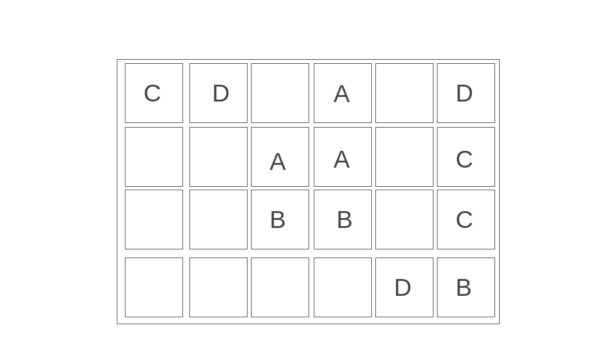
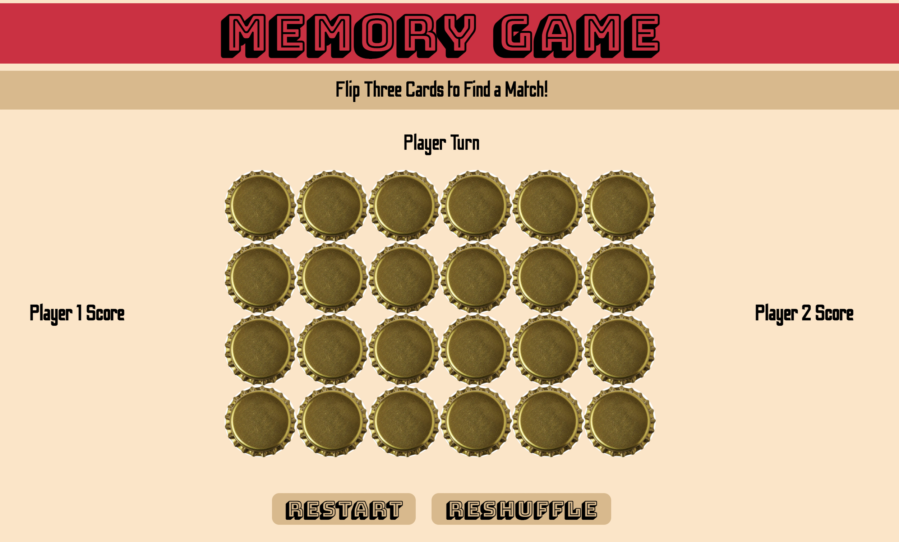
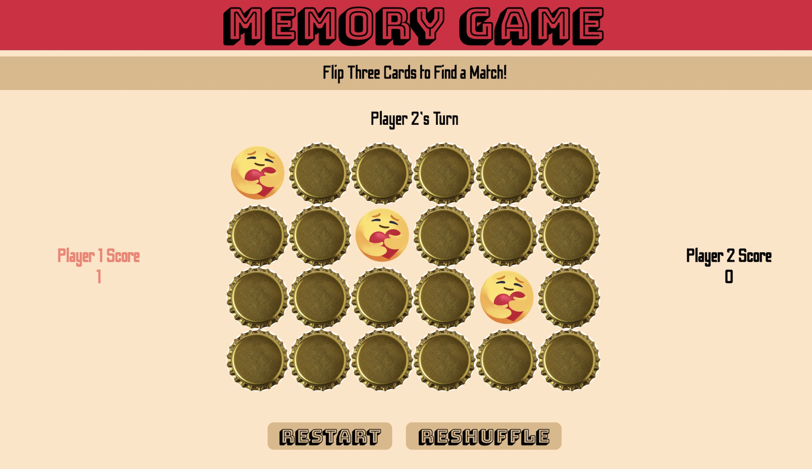
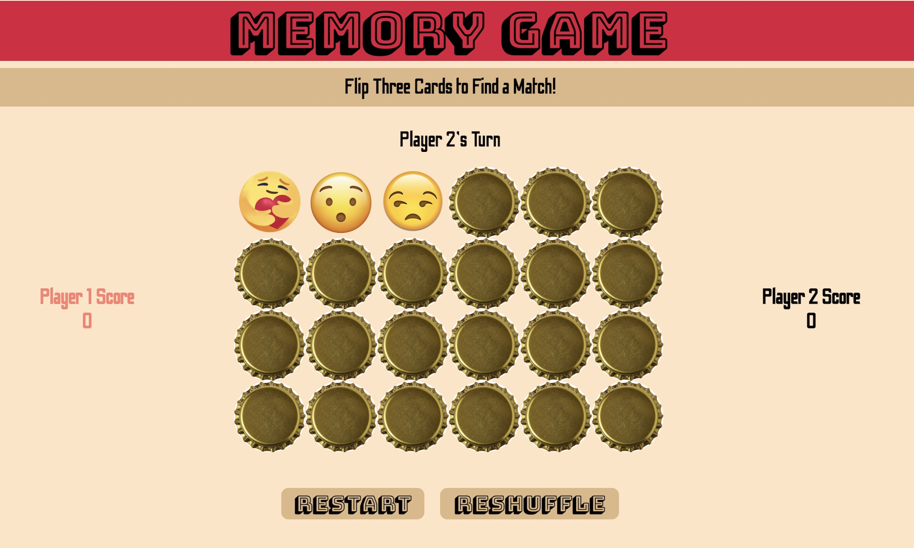

# Memory Game

## Description of the game
The rule of the game is simple. Players should find a match from the cards. A player who finds the most matches wins.

## Motivation
Memory game has always been my childhood game and I occassionally play it with my nephew even nowadays. This has made me to build the memory game of my own. However, I have added some tweaks to make it more interesting: player of the turn flips three cards instead of two to find a match. 

# Getting Started

## Link to the deployed game
- [Github page](https://boyoon-c.github.io/memory-game/)
- [Surge](https://memory-game-chang.surge.sh/)

## Instructions to play the game
- Two players alternate turns.
- Each player should flip three cards at a time to find a match.
- When the three cards are a match, that player who flipped the cards gets one point.
- When the cards that are flipped do not match, players do not get a point. Cards are automatically flipped down and the next player gets the turn.
- Scores accumulate until there are no more cards to flip.
- Player with a higher score wins and the game ends.

## Pseudo code 
```
1.  Will have 4 by 6 board with total of 8 matches (Each player needs to flip three cards) 
      - Create a board
      - Attach event listener for each card on a board that invokes a function of displaying card
2. Shuffle the order of the cards on the board 
   - Create shuffle button
   - Assign type to each card 
   - Attach event listener to the button that invokes a function that uses randomized number to create different combination of a card array
3. Each player flips three cards at a time
   - Create player turn that alternates turns when multiples-of-three clicks are made
4. See if there is a match
   - Compare the type of the flipped cards
   - If there is no match: Make all the cards flip downward
   - If there is a match: Remove the matched cards from the board
5. Track each player’s performance by counting the number of matches that a player found
6. Create restart button to allow players to reset the game or reshuffle the cards
7. If players found all the matches, show the message to reveals who is the winner
```
# Screenshot(s)

## Wireframe



## Deployed game screenshots




# Technologies Used
- Javascript
- HTML
- CSS
- confetti.min.js
- Git

# Next Steps
- [ ] Add timer
- [X] Add sound effect for flipping the cards
- [X] Add sound effect for scoring
- [X] Add congratulating message when all cards are flipped
- [ ] Add blinking animation to denote a player's turn

# Resource and Credits
## Image source
- Emojis
  - Most emojis: https://emojiisland.com/pages/free-download-emoji-icons-png
  - Heart hug emoji: https://pngtree.com/freepng/care-emoji-coronavirus-emoji_5366298.html
- Bottle caps
  - Not flipped version: https://www.amazon.com/Home-Brew-Ohio-Crown-Bottle/dp/B07RDZ4Y58 
  - Flipped version: https://www.vippng.com/preview/hJoibxx_bottle-cap-beer-bottle-cap-png/

## Sound source
- Card flip sound: ["Card Flip Sound Effect" from notification-sounds.com](https://notification-sounds.com/1433-card-flip-sound-effect.html)
- Sound when cards match: ["Unlock game notification" sound from mixkit](https://mixkit.co/free-sound-effects/game/)
- Sound when cards don't match: ["Nope" sound from myinstants](https://www.myinstants.com/instant/nope/)
- Congratulating sound: ["Animated small group applause" sound from mixkit](https://mixkit.co/free-sound-effects/applause/?page=2)
